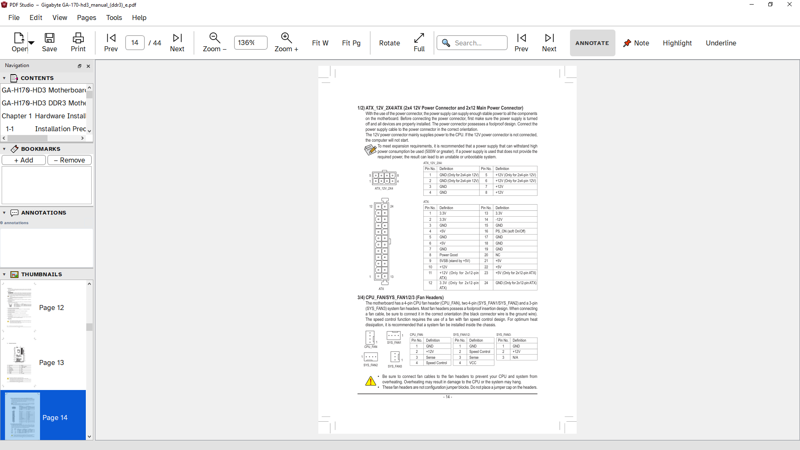

**A Windows-first PDF reader and editor built with Python, PyQt6, and PyMuPDF.**

PDF Studio combines everyday PDF viewing and annotation with OCR, interactive
forms, form design, smart form detection, and controlled editing of text inside
scanned pages.

Created by **Leon Priest** — [github.com/7h3v01d](https://github.com/7h3v01d)  
Released under the **Apache License 2.0**.



## Current release

| | |
|---|---|
| **Version** | `3.2.0-alpha6` |
| **Status** | Alpha — active development |
| **Primary platform** | Windows 10 / 11 |
| **Python** | 3.10+; validated with Python 3.11 |
| **Automated tests** | 45 passing |
| **OCR engine** | Tesseract, detected automatically without editing PATH |

The current release adds a branded, high-DPI-aware startup splash with a
4.5-second minimum display and a smooth fade into the main window. It retains
the transactional image-export workflow and the corrected coordinate path used
by scanned-text editing, signatures, stamps, freehand annotations, and markup.

---

## Highlights

### Read and navigate

- Branded startup splash with a 4.5-second minimum display and smooth fade
- Single-page and continuous-scroll viewing
- Fit width, fit page, zoom, rotation, full screen, and dark mode
- Table of contents, bookmarks, annotations, forms, and page thumbnails
- Full-text search with next/previous navigation
- Recent files and document metadata
- Password-protected PDF opening
- Print and print preview

### Annotate and organise

- Notes, highlights, underlines, strikethrough, and freehand drawing
- Eraser, redaction, stamps, and image signatures
- Drag-and-drop signature images
- Undo and redo for supported editing operations
- Insert, remove, reorder, extract, merge, and split pages
- Save, Save As, and Save a Copy

### OCR and scanned documents

- Add an invisible, searchable OCR text layer
- Verify that searchable words were actually embedded
- Select and replace text inside a scanned page
- Choose reversible white-out overlays or permanent erase-and-replace
- Sample the page background and preview replacement text
- Preserve the original PDF when permanent changes require a clean rewrite

### Interactive forms

- Fill existing AcroForm fields
- Create text fields, checkboxes, dropdowns, dates, radio groups, signatures,
  and initials placeholders
- Move, resize, rename, configure, and delete fields
- Detect likely form fields from labels, lines, boxes, and checkbox geometry
- Review confidence-ranked suggestions before creating anything
- Flatten a completed form to a separate non-editable copy

### Import and export

- Open Word, Excel, OpenDocument, RTF, and CSV files through Microsoft Office
  or LibreOffice conversion
- Export PDF pages to PNG, JPEG, WebP, TIFF, BMP, or static GIF
- Choose current page, all pages, or a discontiguous page range
- Select image resolution up to 1200 DPI, lossy quality, and transparency where supported
- Export PDF content to Word with `pdf2docx`
- Export detected tables to Excel with `tabula-py`
- Encrypt saved PDFs with AES-256 and configurable permissions

---

## Quick start on Windows

### Run from source

1. Install Python 3.10 or newer.
2. Extract the project.
3. Run:

```bat
setup.bat
```

The setup script creates `.venv`, installs the core dependencies, and generates
helper scripts. Then launch PDF Studio with:

```bat
run.bat
```

The equivalent manual commands are:

```bat
python -m venv .venv
.venv\Scripts\python.exe -m pip install --upgrade pip
.venv\Scripts\python.exe -m pip install -r requirements.txt
.venv\Scripts\python.exe src\pdf_reader.py
```

### Build the Windows executable

Use the isolated build script:

```bat
build_clean.bat
```

It creates a temporary `.buildenv`, installs only the required build packages,
and runs PyInstaller. The result is written under:

```text
src\dist\
```

Using the clean build environment avoids accidental inclusion of unrelated
packages or a second Qt binding.

### Startup splash

PDF Studio displays `assets/splashscreen.png` immediately at launch. The main
window is prepared behind it, the artwork remains visible for at least 4.5
seconds, and then fades out over 350 milliseconds. The startup path uses Qt
timers rather than `time.sleep()`, so the application does not deliberately
freeze its event loop. If the splash asset cannot be loaded, PDF Studio falls
back to a normal launch instead of refusing to start.

---

## Tesseract OCR setup

The Python OCR packages are included in `requirements.txt`. OCR also requires
the external **Tesseract-OCR** application.

Recommended Windows installer:
[UB Mannheim Tesseract builds](https://github.com/UB-Mannheim/tesseract/wiki)

PDF Studio searches common installation locations and the Windows registry,
then configures `pytesseract` with the exact path to `tesseract.exe`.

**Users do not need to edit the Windows system PATH.**

When automatic detection fails, the OCR window provides:

- **Detect Again**
- **Locate Tesseract…**
- **Get Tesseract**

Poppler is not required; PDF pages are rendered directly through PyMuPDF.

---

## Core workflows

### Add a searchable OCR layer

1. Open a scanned PDF.
2. Choose **Tools → Run OCR…**.
3. Select the page range and installed language.
4. Save to a new `_ocr.pdf` file or deliberately replace the source.
5. Open the OCR result and test it with `Ctrl+F` or copy/paste.

The page should still look like the original scan. The added text is
intentionally invisible. PDF Studio verifies the saved result and refuses to
report success when no searchable words were embedded.

### Fill an existing PDF form

Interactive fields are detected automatically. Open **Forms** in the navigation
panel to list fields, jump to them, toggle highlighting, or reset values.

Supported controls include:

- single-line and multiline text
- checkboxes
- radio buttons
- dropdowns
- single-choice list boxes
- unsigned signature fields

Form edits mark the document as unsaved and are protected by the normal
save/discard/cancel prompts. Embedded PDF JavaScript and push-button actions are
not executed.

### Create a fillable form

1. Expand **Forms**.
2. Enable **Design mode**.
3. Select a field type.
4. Click or drag on the page to place it.
5. Use **Select** to move or resize the field.
6. Open **Properties…** to configure its name, tooltip, flags, or choices.
7. Save, turn Design mode off, and fill the form normally.

The designer creates genuine AcroForm widgets rather than decorative overlays.

### Detect fields on a scanned form

1. Open **Forms → Smart Form Detection**.
2. Choose **More suggestions**, **Balanced**, or **High confidence**.
3. Select **Detect Current Page…**.
4. Review the proposals in the resizable review window.
5. Untick incorrect suggestions and choose **Create Checked**.

Detection can use native PDF text or Tesseract OCR. Existing fields suppress
overlapping suggestions, and no field is created without explicit approval.

### Replace text in a scan

1. Choose **Tools → Edit Scanned Text…**. The toolbar shortcut may also be
   available when the full toolbar width is visible.
2. Drag a tight rectangle around a word, number, or short line.
3. Release the mouse and wait for **Preparing Scanned-Text Editor**.
4. Correct the recognised text and review the preview.
5. Choose one of the following:

**Reversible white-out overlay**

- Preserves the original scan beneath an opaque FreeText annotation
- Supports undo and redo
- Can be removed from the Annotations panel

**Permanent erase and replacement**

- Removes text, line art, and image pixels inside the selected rectangle
- Burns the replacement into the page
- Requires confirmation
- Forces Save As to a new `_edited.pdf` file
- Performs a clean rewrite so removed content is not retained in an incremental
  revision

Selected-region OCR currently defaults to Tesseract's English model. Other
languages can still be entered manually in the replacement editor.

### Flatten a completed form

Use **Flatten Form to Copy…** to create a separate PDF whose visible answers are
baked into the pages and whose interactive widgets have been removed. PDF
Studio verifies the flattened result and does not overwrite the editable source.

---

### Export PDF pages as images

Choose:

```text
File → Export As → Image Files (.png, .jpg, .webp, .tiff, .bmp, .gif)…
```

Then select:

- **All pages**, **Current page**, or a range such as `1-3, 6, 9-10`
- PNG, JPEG, WebP, TIFF, BMP, or GIF
- Resolution from 36 to 1200 DPI; 300 DPI is a strong default for posters and printing
- JPEG/WebP quality
- Transparent background for PNG, WebP, and TIFF

A single selected page is saved to one chosen image file. Multiple selected
pages are written as numbered files such as `poster_page_001.png`. GIF export is
intentionally static: a multi-page PDF produces one GIF per selected page, not
an animation.

The exporter stages every image before replacing destination files. A failed or
cancelled multi-page run therefore does not leave a half-exported set or destroy
pre-existing images.

## Optional integrations

The core reader, editor, forms, and OCR Python components are installed from
`requirements.txt`. These integrations are optional.

### Export to Word

```bat
.venv\Scripts\python.exe -m pip install pdf2docx
```

### Export to Excel

```bat
.venv\Scripts\python.exe -m pip install tabula-py openpyxl pandas
```

`tabula-py` also requires a Java runtime.

### High-fidelity Word and Excel import

```bat
.venv\Scripts\python.exe -m pip install pywin32
```

On Windows, PDF Studio prefers Microsoft Word or Excel automation when Office is
installed. LibreOffice is used as the free fallback converter.

---

## Testing

Install the development requirements once:

```bat
.venv\Scripts\python.exe -m pip install -r requirements-dev.txt
```

Run the test suite with:

```bat
run_tests.bat
```

or:

```bat
.venv\Scripts\python.exe -m pytest tests -v
```

Current expected result:

```text
45 passed
```

The suite covers:

- existing-form value persistence and flattening
- field creation, naming, movement, resizing, properties, and deletion
- dropdown, date, radio, signature, and initials structures
- smart-detection review and approved-field persistence
- reversible scanned-text overlays and metadata
- permanent vector-text, vector-line, and raster-pixel removal
- background sampling and font fitting
- mouse-selection endpoint handling
- inverse-matrix point and rectangle conversion
- strict page-range parsing and discontiguous page selection
- PNG/JPEG/GIF rendering, DPI dimensions, and transparent PNG output
- transactional cleanup when a later page fails
- startup minimum-duration timing and active-screen splash scaling

These automated tests validate the document model and critical conversion paths.
They do not replace final Windows GUI interaction testing.

---

## Project structure

```text
src/
├── pdf_reader.py                    Application entry point
├── pdf_reader_app.py                Main application logic
├── pdf_reader_ui.py                 Menus, toolbars, and navigation UI
├── pdf_page_widget.py               Page rendering and pointer interaction
├── pdf_scroll_area.py               Zoom and scrolling behaviour
├── pdf_utils.py                     Shared PDF operations and coordinates
├── annotations_panel.py             Annotation inventory and controls
├── forms_panel.py                   Forms inventory and designer controls
├── form_designer_core.py            Tested AcroForm editing operations
├── form_field_dialog.py             Field properties editor
├── form_detection_core.py           OCR/layout form suggestion engine
├── form_detection_worker.py         Background page analysis
├── form_detection_review_model.py   Testable review-state model
├── form_detection_review_dialog.py  Suggestion approval window
├── scan_text_edit_core.py           Replacement and redaction engine
├── scan_text_edit_worker.py         Selected-region OCR worker
├── scan_text_edit_dialog.py         Replacement editor and preview
├── ocr_dialog.py                    Full-document OCR workflow
├── tesseract_setup.py               Tesseract discovery and validation
├── merge_split_dialog.py            Merge and split operations
├── extract_pages_dialog.py          Page extraction
├── export_dialog.py                 Word, Excel, and image export
├── image_export_core.py             Tested page rendering and transactional output
├── splash_screen.py                 Transparent splash window and fade animation
├── startup_splash_core.py           Tested timing and screen-fitting rules
├── signature_dialog.py              Drawn signature editor
├── password_dialog.py               Opening and encryption passwords
├── undo_stack.py                    Undo/redo command stack
└── about_dialog.py                  Product metadata and About window

tests/                               Structural and regression tests
docs/                                User Manual and Easy Guide sources/PDFs
assets/                              Screenshots and artwork
```

Application metadata is centralised at the top of `src/about_dialog.py`:

```python
APP_NAME = "PDF Studio"
APP_VERSION = "3.2.0-alpha6"
COMPANY_NAME = "Leon Priest"
```

The PyInstaller output name is configured in `src/PDF Studio.spec`.

---

## Known limitations

- This is an alpha release and should not be the only copy of important files.
- Certificate-backed digital signing is not implemented. Signature fields and
  image signatures are supported, but they are different features.
- Selected-region OCR currently defaults to English.
- Scanned-text replacement approximates the original typeface; it does not
  reconstruct the source font perfectly.
- Automatic form detection is intentionally conservative and still requires
  review.
- Complex Word/Excel conversion fidelity depends on Microsoft Office or
  LibreOffice being installed.
- Multi-selection list boxes currently retain one selected value through the
  PyMuPDF-backed form layer.

---

## Windows file association

From inside PDF Studio, choose:

```text
File → Set as Default PDF App…
```

The application registers itself per-user and opens Windows Default Apps for the
final confirmation. Windows does not allow an application to silently take over
`.pdf` associations.

Command-line alternatives:

```bat
register_pdf.bat
unregister_pdf.bat

"PDF Studio.exe" --register
"PDF Studio.exe" --register --pdf-only
"PDF Studio.exe" --unregister
```

---

## Keyboard shortcuts

| Shortcut | Action | Shortcut | Action |
|---|---|---|---|
| `Ctrl+O` | Open | `Ctrl+S` | Save |
| `Ctrl+Shift+S` | Save As | `Ctrl+P` | Print |
| `Ctrl+Shift+P` | Print preview | `Ctrl+F` | Search |
| `F3` / `Shift+F3` | Next / previous result | `Ctrl+C` | Copy selected text |
| `Ctrl+Z` / `Ctrl+Y` | Undo / redo | `Ctrl+R` | Rotate 90° |
| `Ctrl++` / `Ctrl+-` | Zoom in / out | `Ctrl+Shift+H` | Fit width |
| `Ctrl+Shift+F` | Fit page | `F4` | Toggle navigation panel |
| `F11` | Full screen | `Escape` | Cancel active tool |
| `←` / `→` | Previous / next page | `Ctrl+Home` / `Ctrl+End` | First / last page |
| `Ctrl+B` | Add bookmark | `Ctrl+Q` | Quit |

---

## Recent changelog

### 3.2.0-alpha6 — branded startup splash

- Added the supplied transparent 750 × 500 PDF Studio splash artwork.
- Added a 4.5-second minimum display without blocking `time.sleep()`.
- Added a 350 ms fade before revealing the prepared main window.
- Added active-screen centring, high-DPI scaling, and source/PyInstaller resource lookup.
- Added a non-fatal fallback when the cosmetic splash asset is unavailable.
- Added four startup timing and sizing regression tests.

### 3.2.0-alpha5 — PDF page image export

- Added PNG, JPEG, WebP, TIFF, BMP, and static GIF export.
- Added current-page, all-page, and discontiguous page-range selection.
- Added DPI, quality, and supported-transparency controls.
- Added numbered page filenames for multi-page exports.
- Added transactional staging and rollback protection.
- Added 12 image-export regression tests.

### 3.2.0-alpha4 — PDF coordinate conversion correction

- Corrected the PyMuPDF matrix-inversion implementation.
- Fixed scanned-text selections collapsing into empty PDF rectangles.
- Corrected the same conversion path for signatures, stamps, freehand
  annotations, and point-based markup lookup.
- Added inverse-matrix point and rectangle regression tests.

### 3.2.0-alpha3 — Windows selection handoff

- Preserved the last valid drag endpoint when release coordinates collapse.
- Added local, global, and last-painted endpoint candidates.
- Queued OCR after the mouse-release event returned to Qt.
- Added selection-state and minimum-size regression tests.

### 3.2.0-alpha2 — scanned-text OCR reliability

- Added a visible preparation window.
- Reduced selected-region OCR to one Tesseract data pass.
- Hardened worker/thread lifetime and abnormal-exit handling.
- Opened the editor for manual replacement when OCR fails.

### 3.2.0-alpha1 — scanned-text replacement

- Added selected-region OCR and replacement preview.
- Added reversible overlay and permanent erase-and-replace modes.
- Added clean-rewrite Save As protection for permanent removal.

### 3.1.0-alpha2 — Smart Detection review dialog

- Moved proposal review out of the cramped navigation sidebar.
- Added resizable confidence, label, rationale, and bulk-selection controls.
- Made the Forms panel internally scrollable.

### 3.1.0-alpha1 — OCR-assisted form detection

- Added native-text and Tesseract-backed current-page analysis.
- Added label, line, box, checkbox, date, and signature suggestions.
- Added explicit approval before creating persistent AcroForm fields.

### 3.0.0-alpha3 — rich form controls

- Added dropdowns, date fields, linked Yes/No radios, signatures, and initials.

### 3.0.0-alpha2 — Form Designer

- Added genuine field creation, selection, movement, resizing, properties, and
  deletion.

### 3.0.0-alpha1 — existing forms

- Added form detection, filling, persistence, reset, and verified flattening.

---

## Documentation

The project includes:

- `docs/PDF_Studio_Manual.pdf`
- `docs/PDF_Studio_Easy_Guide.pdf`
- Markdown sources and build scripts for both documents

---

## License

Copyright © 2025–2026 Leon Priest.

Licensed under the [Apache License 2.0](LICENSE.txt). You may use, modify, and
distribute the project subject to the licence terms and preservation of the
required notices.
